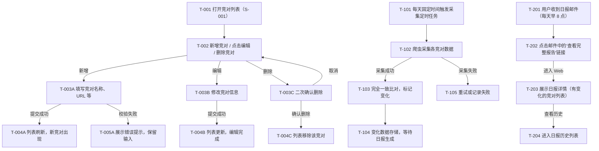

> 目的：把 solution.md 的 Mini-PRD 转写为可走查、可评审的交互说明，消除实现与验收歧义。
>
> 基于 solution.md 第 8 章 Mini-PRD 生成（无单独 prd.md）。

## 0. 基本信息

- 需求标识：001-competitor-monitoring
- 作者 / 参与评审：AI Assistant
- 状态：draft
- 最后更新：2026-06-17
- Figma 链接：无（MVP 版本暂无设计稿）
- 基于来源：`.aisdlc/specs/001-competitor-monitoring/requirements/solution.md#8`

---

## 1. 场景清单

| 场景编号 | 场景标题（用户视角） | 成功标准 | 任务流节点 | 页面链路摘要 | Mini-PRD 对应内容 |
|---|---|---|---|---|---|
| S-001 | 竞对列表管理 | 能成功新增/编辑/删除竞对；列表实时更新 | T-001 → T-002 → T-003 | P-001 → P-002 | MVP In: 用户可添加/编辑/删除监控竞对列表 |
| S-002 | 每日采集与检测 | 系统每天按时采集；变化检测准确度 > 95% | T-101 → T-102 → T-103（后台） | (系统内部流程) | MVP In: 系统每天自动采集、完全一致比对、标记变化 |
| S-003 | 日报查看 | 用户收到日报邮件；能点击查看完整报告 | T-201 → T-202 → T-203 | P-003（Web）→ 邮件 | MVP In: 系统每天固定时间发送日报邮件；用户可查看历史日报 |

---

## 2. 端到端任务流



---

## 3. 页面/弹窗清单

| Node ID | 类型 | 名称/目的 | 入口 | 覆盖任务流节点 | 覆盖场景 | 备注 |
|---|---|---|---|---|---|---|
| P-001 | P | 竞对列表页 | 应用首页 / 导航菜单 | T-001, T-002 | S-001 | 主要交互入口 |
| P-002 | P | 竞对详情/编辑页 | P-001 新增或编辑操作 | T-003A, T-003B | S-001 | 含表单与验证 |
| D-001 | D | 删除确认弹窗 | P-001 删除操作 | T-003C | S-001 | 二次确认，高风险 |
| P-003 | P | 日报详情页（Web） | 邮件中的链接 | T-202, T-203 | S-003 | 展示日报内容与历史 |

---

## 4. 页面说明

### 4.1 P-001 竞对列表页

#### 4.1.1 入口与目的

- **ID**：P-001
- **页面目的**：展示用户已监控的竞对列表；支持新增、编辑、删除竞对
- **入口**：应用首页 / 左侧导航"竞对管理"菜单项
- **前置条件**：用户已登录；具有竞对列表读写权限
- **涉及场景**：S-001（竞对列表管理）

#### 4.1.2 ASCII 线框

```text
P-001 竞对列表管理页
+------------------------------------------------------------------------+
| Lensmor Monitor - 竞对监控平台                                         |
+------------------------------------------------------------------------+
| [导航菜单] | 竞对管理 | 日报 | 设置 |                        [用户菜单] |
+------------------------------------------------------------------------+
|                                                                        |
| 竞对列表 (共 N 个在线竞对)                 [+ 新增竞对]                 |
|                                                                        |
| +----+------------------+----------+----------+--+                    |
| | ID | 竞对名称          | 添加时间 | 最后采集 | 操作 |                |
| +----+------------------+----------+----------+--+                    |
| | 1  | 竞对 X            | 2026-06-10 | 2026-06-17 | 编辑 删除 |       |
| | 2  | 竞对 Y            | 2026-06-12 | 2026-06-17 | 编辑 删除 |       |
| | 3  | 竞对 Z (新增)      | 2026-06-17 | - | 编辑 删除 |               |
| +----+------------------+----------+----------+--+                    |
|                                                                        |
| [上一页] [1] [2] [下一页]  (分页导航)                                   |
|                                                                        |
| 提示: 采集状态显示在列表下方，如"最后采集失败"或"采集中..."          |
|                                                                        |
+------------------------------------------------------------------------+
```

#### 4.1.3 关键状态与反馈

| 状态 | 触发条件 | 界面要点 | 恢复路径 |
|---|---|---|---|
| 正常 | 列表加载完成 | 展示完整竞对列表，每行可编辑/删除 | - |
| 加载中 | 列表首次加载或刷新 | 展示加载动画/骨架屏 | 完成后自动进入正常态 |
| 空列表 | 用户未添加任何竞对 | 展示"暂无竞对"提示 + "新增竞对"按钮 | 点击按钮进入 P-002 |
| 错误 | 列表加载失败或操作异常 | 展示错误提示"加载失败，请刷新重试" + 刷新按钮 | 用户点击刷新按钮 |
| 无权限 | 用户缺少权限 | 列表隐藏或只读；新增/编辑/删除按钮禁用 | 提示"请联系管理员" |

#### 4.1.4 关键校验与错误处理

- **校验-1**：删除操作 - 点击删除后必须展示 D-001 二次确认弹窗，防止误操作
- **校验-2**：列表刷新 - 编辑/删除/新增后，列表应在 1 秒内刷新，展示最新状态
- **校验-3**：采集状态 - 如果最近采集失败，列表"最后采集"列展示失败标记与失败原因（引用 V-001 采集可行性验证）

#### 4.1.5 跳转与交互

- **新增操作**：点击"+ 新增竞对"按钮 → 跳转到 P-002（新增模式）
- **编辑操作**：点击列表中竞对行的"编辑"按钮 → 跳转到 P-002（编辑模式，预填竞对信息）
- **删除操作**：点击列表中竞对行的"删除"按钮 → 弹出 D-001 二次确认弹窗
- **成功反馈**：操作成功后展示 toast 提示"竞对已新增/更新/删除"，2 秒后消散；列表同步刷新

---

### 4.2 P-002 竞对详情/编辑页

#### 4.2.1 入口与目的

- **ID**：P-002
- **页面目的**：编辑竞对信息（新增或修改），支持输入竞对名称、URL、备注等
- **入口**：P-001 "新增竞对"按钮或"编辑"按钮
- **前置条件**：用户登录；具有写权限
- **涉及场景**：S-001（竞对列表管理）

#### 4.2.2 ASCII 线框

```text
P-002 竞对编辑页
+------------------------------------------------------------------------+
| 竞对信息编辑                                                           |
+------------------------------------------------------------------------+
|                                                                        |
| 竞对名称: [__________________________]  <必填>                         |
|          <字段下方错误提示："竞对名称不能为空" / "竞对已存在">       |
|                                                                        |
| 竞对 URL: [__________________________]  <可选>                         |
|          <字段下方错误提示："URL 格式不正确">                         |
|                                                                        |
| 备注:     [__________________________]                                  |
|          (可选，文本区域)                                             |
|          <支持 500 字以内>                                            |
|                                                                        |
| 监控维度: [ ] 网站改版  [ ] 定价变化  [ ] 社媒舆情  [ ] AI 讨论         |
|          (多选，默认全选)                                             |
|                                                                        |
| 操作: [取消] [保存]                                                     |
|                                                                        |
| 提示: 所有信息将每天采集并检测变化。                                  |
|                                                                        |
+------------------------------------------------------------------------+
```

#### 4.2.3 关键状态与反馈

| 状态 | 触发条件 | 界面要点 | 恢复路径 |
|---|---|---|---|
| 正常 | 页面初始加载（编辑模式预填信息） | 表单可编辑，保存按钮可用 | - |
| 加载中 | 编辑模式从服务端加载竞对信息 | 表单字段显示加载占位符 | 加载完成后填充信息 |
| 校验失败 | 用户点保存，字段验证不通过 | 展示字段级错误提示；保存按钮仍可用 | 用户修正后重新保存 |
| 提交中 | 用户点保存，请求已发送 | 保存按钮禁用，显示"保存中..."状态 | 完成后回到正常态或失败态 |
| 提交成功 | 服务端返回 200 | 展示 toast"竞对已保存"，2 秒后返回 P-001 | - |
| 提交失败 | 服务端返回错误 | 展示错误提示"保存失败，请重试" | 用户可重新尝试或返回 |

#### 4.2.4 关键校验与错误处理

- **校验-1**：竞对名称 - 必填；不允许重复（同一用户不能重复添加相同竞对名）；提示文案"竞对名称不能为空"或"竞对已存在"
- **校验-2**：URL 格式 - 如填写，必须是有效 HTTP/HTTPS URL；提示"URL 格式不正确，请输入有效网址"
- **校验-3**：备注长度 - 最多 500 字；超过则禁用保存，提示"备注超过 500 字"

#### 4.2.5 跳转与交互

- **保存成功**：返回 P-001，列表已更新
- **保存失败**：停留在 P-002，表单内容保留（允许重试）
- **取消操作**：返回 P-001，表单内容不保存（需确认是否有未保存修改 → 触发二次确认）

---

### 4.3 D-001 删除确认弹窗

#### 4.3.1 入口与目的

- **ID**：D-001
- **目的**：二次确认删除竞对（高风险操作），防止误删
- **入口**：P-001 竞对列表行的"删除"按钮
- **前置条件**：用户已选中要删除的竞对
- **涉及场景**：S-001（竞对列表管理）

#### 4.3.2 ASCII 线框

```text
D-001 删除确认弹窗
+----------------------------------------------------+
| ⚠️  确认删除                                        |
+----------------------------------------------------+
|                                                    |
| 确定要删除竞对"[竞对名称]"吗？                     |
|                                                    |
| 删除后将停止监控该竞对，但历史日报数据保留。      |
|                                                    |
| [取消] [确定删除]                                  |
|                                                    |
+----------------------------------------------------+
```

#### 4.3.3 关键状态与反馈

| 状态 | 触发条件 | 界面要点 | 恢复路径 |
|---|---|---|---|
| 正常 | 弹窗初始展示 | 显示竞对名称与风险提示；两个按钮可用 | - |
| 删除中 | 用户点"确定删除"，请求已发送 | "确定删除"按钮禁用，显示"删除中..." | 完成后关闭弹窗 |
| 删除成功 | 服务端返回 200 | 弹窗关闭，P-001 列表刷新，竞对已移除 | - |
| 删除失败 | 服务端返回错误 | 展示错误提示"删除失败，请重试" | 用户可重试或关闭弹窗 |

#### 4.3.4 关键校验与错误处理

- **高风险操作**：删除是不可逆的；弹窗必须清晰表达风险（"将停止监控"）
- **防误操作**：弹窗默认焦点在"取消"按钮，用户需主动点击"确定删除"才能删除

#### 4.3.5 跳转与交互

- **确定删除**：发送删除请求 → 成功后关闭弹窗，P-001 列表刷新
- **取消**：关闭弹窗，返回 P-001，列表不变

---

### 4.4 P-003 日报详情页（Web）

#### 4.4.1 入口与目的

- **ID**：P-003
- **页面目的**：展示特定日期的日报内容（有变化的竞对及简要描述），支持查看历史日报
- **入口**：邮件中的"查看完整报告"链接（含 date 参数）；或从历史列表点击某条日报
- **前置条件**：用户已登录或通过邮件认证链接访问；有日报查看权限
- **涉及场景**：S-003（日报查看）

#### 4.4.2 ASCII 线框

```text
P-003 日报详情页
+------------------------------------------------------------------------+
| Lensmor Monitor - 日报详情                                             |
+------------------------------------------------------------------------+
| [导航] | 竞对管理 | 日报 | 设置 |                              [用户] |
+------------------------------------------------------------------------+
|                                                                        |
| 日报：2026-06-17                                   [历史日报]          |
|                                                                        |
| 本次日报共检测 N 个竞对，发现 M 条变化。                              |
|                                                                        |
| +----+-------------------+------------------------+--------+         |
| | # | 竞对名称          | 变化描述                | 变化类型 |        |
| +----+-------------------+------------------------+--------+         |
| | 1 | 竞对 X            | 定价从 $100 变成 $120  | 定价   |         |
| | 2 | 竞对 Y            | 产品页面结构调整       | 网站   |         |
| | 3 | 竞对 Z            | 社媒提及增加 50%       | 舆情   |         |
| +----+-------------------+------------------------+--------+         |
|                                                                        |
| 页面级提示：本日报基于自动检测生成，展示了相比前一日的变化。          |
| 更多分析见原始日报邮件。                                               |
|                                                                        |
| [返回列表] [导出 PDF]                                                  |
|                                                                        |
+------------------------------------------------------------------------+
```

#### 4.4.3 关键状态与反馈

| 状态 | 触发条件 | 界面要点 | 恢复路径 |
|---|---|---|---|
| 正常 | 日报数据加载完成 | 展示完整日报表格，包含竞对、变化描述、变化类型 | - |
| 加载中 | 页面初始加载 | 展示加载动画/骨架屏 | 加载完成后进入正常态 |
| 无变化 | 该日期无任何竞对数据变化 | 展示"今日暂无变化"提示；表格为空 | 用户可查看其他日期 |
| 错误 | 日报数据加载失败 | 展示"加载失败，请刷新重试" | 用户点刷新按钮或返回列表 |
| 无权限 | 用户无日报查看权限 | 展示"无权限查看该日报" | 提示联系管理员 |

#### 4.4.4 关键校验与错误处理

- **校验-1**：日期有效性 - URL 中的 date 参数必须有效；无效日期则展示错误提示
- **校验-2**：变化描述清晰 - 每条变化必须包含"竞对名称"、"具体变化"、"变化类型"三元素（引用 V-003 变化检测准确度验证）

#### 4.4.5 跳转与交互

- **历史日报**：点击"历史日报"按钮 → 展开或跳转到日报历表页面，显示过去 N 天的日报列表
- **返回列表**：点击"[返回列表]" → 回到竞对列表页 P-001
- **导出 PDF**：点击"[导出 PDF]" → 下载当前日报为 PDF 文件（可选功能，暂不在 MVP 范围内）

---

## 5. AC → 交互节点映射

| AC-ID / 描述 | 场景 | 任务流节点 | 页面/节点 | 验证点 |
|---|---|---|---|---|
| AC-001: 用户能新增竞对 | S-001 | T-002 → T-003A → T-004A | P-001 / P-002 | P-002 表单提交成功后，P-001 列表刷新，新竞对出现 |
| AC-002: 采集成功率 > 95% | S-002 | T-101 → T-102 → T-103 | (后台系统) | P-001 列表中"最后采集"字段展示成功状态；采集失败时展示失败标记（引用 V-001） |
| AC-003: 变化检测精准度 > 95% | S-002 | T-103 | (后台系统) | P-003 日报中的变化描述与实际数据变化一致（引用 V-003） |
| AC-004: 日报自动生成 | S-003 | T-104 → 邮件生成 | 邮件 / P-003 | 每天早 8 点，用户收到日报邮件；邮件中包含变化竞对的清单 |
| AC-005: 邮件送达率 > 99% | S-003 | T-201 | 邮件系统 | 用户收到日报邮件，时间在预计发送时间 ±5 分钟内（引用 V-002） |
| AC-006: 日报可查看 | S-003 | T-202 → T-203 | P-003 | 用户点击邮件链接进入 P-003，能正确展示该日期的日报详情 |
| AC-007: 支持 10 个并发竞对 | S-001 / S-002 / S-003 | 所有节点 | 系统整体 | 系统能同时监控 ≥10 个竞对，无性能下降（引用 V-004 用户可用性验证中的"易用性"指标） |

---

## 6. 走查/验证脚本

### 6.1 覆盖的验证清单条目

- **V-001**：爬虫数据采集可行性（采集成功率 > 95%） → 在 P-001 列表中展示采集状态
- **V-002**：邮件投递可靠性（送达率 > 99%） → 用户能在预期时间收到日报邮件
- **V-003**：变化检测准确度（精准度 > 95%） → P-003 日报中的变化描述准确无误
- **V-004**：用户可用性（NPS/易用性评分） → 用户能顺利完成竞对新增、编辑、查看日报的全流程

### 6.2 任务脚本

**任务-1（S-001 竞对列表管理）**

- **任务目标**：用户能成功新增、编辑、删除竞对，列表实时更新
- **关键步骤**：
  1. 进入 P-001（竞对列表页）
  2. 点击"+ 新增竞对"按钮，进入 P-002（新增模式）
  3. 填写竞对名称"Test Competitor"、URL"https://example.com"
  4. 点保存，表单提交成功
  5. 返回 P-001，列表中出现新竞对
  6. 找到新竞对行，点"编辑"，进入 P-002（编辑模式）
  7. 修改竞对名称为"Test Competitor Updated"，保存
  8. 返回 P-001，列表已更新
  9. 找到该竞对，点"删除"，D-001 弹窗展示
  10. 点"确定删除"，弹窗关闭，列表中竞对移除
- **成功标准**：
  - 新增：竞对成功添加到列表，无错误提示
  - 编辑：竞对信息更新，列表反映最新状态
  - 删除：竞对从列表移除，二次确认弹窗正常工作
- **观察点/记录项**：
  - 表单校验是否生效（必填字段、URL 格式等）
  - 操作反馈是否及时（toast 提示、列表刷新延迟）
  - 错误提示文案是否清晰
  - 二次确认流程是否有效防止误操作

**任务-2（S-003 日报查看）**

- **任务目标**：用户能收到日报邮件并查看完整日报
- **关键步骤**：
  1. 监控至少一个竞对，等待下一个日报发送时间（每天早 8 点）
  2. 查收邮箱，确认收到"Lensmor Monitor 日报"邮件
  3. 在邮件中找到"查看完整报告"链接，点击
  4. 进入 P-003（日报详情页），展示该日期的日报
  5. 确认表格中显示的竞对与变化描述准确
  6. 点击"历史日报"，查看过去 N 天的日报列表
  7. 选择某一天的日报，查看该日期的详情
- **成功标准**：
  - 邮件送达：用户在预期时间（±5 分钟）收到日报邮件
  - 邮件内容：邮件包含"查看完整报告"链接
  - 日报页面：P-003 正确展示该日期的竞对变化
  - 历史查询：用户能查看过去的日报，数据准确
- **观察点/记录项**：
  - 邮件是否落进垃圾箱
  - 邮件中的链接是否有效（点击后成功进入 P-003）
  - 日报内容是否与采集数据一致
  - 页面加载速度与稳定性
  - 变化描述是否清晰准确

### 6.3 问题记录模板

| 问题 | 严重度 | 复现步骤 | 影响范围 | 建议修复方向 |
|---|---|---|---|---|
| 示例：新增竞对后列表未刷新 | S1 | 1. 新增竞对 2. 提交表单 3. 返回列表 | P-001 列表页、AC-001 | 检查列表刷新逻辑；确保 POST 请求成功后触发列表重新加载 |
| | | | | |

### 6.4 结论与回流

- **结论摘要**：原型走查完成后，基于发现的问题反馈给产品和设计团队
- **问题分类**：
  - **S1（阻断性）**：功能完全不工作，必须立即修复 → 回流 `solution.md` 更新方案或验证清单
  - **S2（严重）**：功能部分不工作或用户体验明显受损 → 回流 `prototype.md` 调整交互
  - **S3（轻微）**：文案优化、样式调整等 → 可合并到实现阶段
- **需要回流更新的文件**：
  - `requirements/solution.md`：若发现 MVP 范围、AC、验证清单需要补齐或调整
  - `requirements/prototype.md`：若发现页面交互、状态定义、错误处理需要调整
  - `requirements/raw.md`：若走查发现原始需求与实现存在重大偏差

---

## 7. 追溯链接

- **Mini-PRD（来源）**：`requirements/solution.md#8`
- **Solution**：`requirements/solution.md`（验证清单、Impact Analysis 入口）
- **Raw**：`requirements/raw.md`（澄清记录与证据入口）
- **术语与口径**：无（`.aisdlc/project/memory/glossary.md` 不存在）

---

## 8. R3-DoD 自检

- [x] 交互内容与 Mini-PRD 的场景/AC 一一对应
- [x] 任务流、节点清单与页面清单一致（可追溯、可定位）
- [x] 每个页面至少包含：入口、ASCII 线框、状态、跳转
- [x] 关键状态覆盖完整（正常/加载/空/错/无权限；提交类交互包含成功/失败反馈）
- [x] 高风险/不可逆操作包含风险提示与二次确认（D-001 删除确认弹窗；AC-007 性能验证链到 V-004）
- [x] 与 Mini-PRD 的 AC 可追溯（第 5 章 AC 映射表完整）
- [x] 包含走查/验证脚本（第 6 章完整，含问题记录模板与回流规则）

---

## 9. 后续建议

- **原型评审**：建议在 I1 设计阶段前，由产品/设计/研发共同走查本原型，确保交互理解一致
- **高保真设计**：若需要，可在本原型基础上用 Figma/Sketch 生成高保真设计稿，但 ASCII 线框作为标准化参考保留
- **性能与成本验证**：在 I1/I2 实现阶段，需要同步进行 V-001/V-002/V-003/V-005 的技术验证，确保 MVP 可行性
